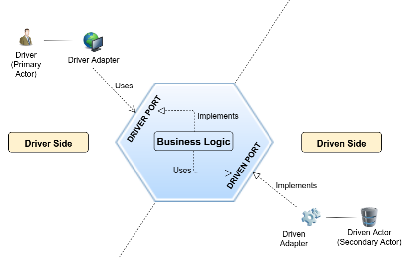

# Project
> Kotlin with Quarkus and Hexagon architecture

# Technologies

- Gradle
- Kotlin (Java 11)
- Quarkus
- PostgreSQL
- Flyway

# Study sources

- https://jmgarridopaz.github.io/content/hexagonalarchitecture.html
- https://herbertograca.com/2017/09/14/ports-adapters-architecture
- https://herbertograca.com/2017/09/07/domain-driven-design

# Explanation

Here is an image of the *Hexagon* and *DDD* architectural.

* The module `project-application` is the *driver* that uses the ports to `project-core`
  > Here is the framework, CDI, Rest controllers

- The module `project-core` is the *domain* that publish ports to `project-application` to use 
and uses `project-infrastructure`
  > Here is just the language (Kotlin for example)

- The module `project-infrastructure` is the *driven* that implements the ports from `project-core`
  > Here is all technologies to help like PostgreSQL

- All packages are splitted by feature
