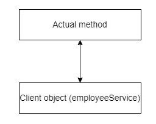
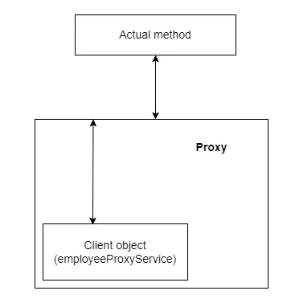
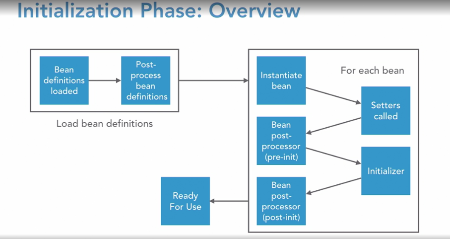

# Spring Framework Depth

- Based: https://www.linkedin.com/learning/spring-framework-in-depth-2
- Open-source project
- You can focus on business
- Spring manage the dependencies

## Spring Core Module

- Beans
- Core
- Context
- SpEL

`SpEL` is a module that provides a powerful expression language for change objects during execution.

`Context` where ApplicationContext and BeanFactory works. Beans lifecycle, i18n and ETC occurs here.

`Core` provide keys parts of the framework like IoC and DI.

`Beans` is responsible for managing Spring Beans. BeanFactory.

## Spring Core Concepts

- IoC, Inversion of Control, Principle
  - DI, Dependency Injection, Pattern
  - IoC Container, Framework
- DIP, Dependency Inversion Principle, Principle
- AOP, Aspect-Oriented Programming, Language

`IoC` means that the control of flow is inverted and makes the programmer not responsible for how/when objects are called.

`DI` one of many implementation of IoC.

`IoC Container` is a framework that implements IoC principle and manage the lifecycle of objects.

`AOP` is a programming language with aspect paradigm that allow you to cross-cutting concerns. The unit key is aspect.

- ApplicationContext wraps the BeanFactory
- Objects are injected on runtime or start time
- Spring use annotations as pointcuts to provide injection

## Spring Framework Overview


## Spring Core Dependencies

Spring Core and Context dependencies:

```xml
<dependencies>
    <dependency>
        <groupId>org.springframework</groupId>
        <artifactId>spring-core</artifactId>
        <version>${spring.version}</version>
    </dependency>
    <dependency>
        <groupId>org.springframework</groupId>
        <artifactId>spring-context</artifactId>
        <version>${spring.version}</version>
    </dependency>
</dependencies>
```

Create a class and do your configuration of Beans:

```java
@Configuration
public class ApplicationConfig { }
```

Create your ApplicationContext and get your Beans:

```java
public class SpringContextApplication {
    public static void main(String[] args) {
        ApplicationContext context = new AnnotationConfigApplicationContext(ApplicationConfig.class);
        OutputService outputService = context.getBean(OutputService.class);
    }
}
```

## Configuring the ApplicationContext

- Java-based config
- XML-based config (old)

### Configuration

- `@PropertySource("classpath:application.properties")` to get configs
  - Java-based config
- Spring Boot use autoconfiguration to bind properties

### Profiles

- Change behavior
- `@Profile` annotation to set profile on Beans
- `spring.profiles.active` property to activate profile

### Environment

Example of class:

```java
@Configuration
@PropertySource("classpath:application.properties")
public class PropertyApplicationConfig { }
```

### SpEL (Spring Expression Language)

Example of class:

```java
@Configuration
@PropertySource("classpath:application.properties")
public class PropertyApplicationConfig {
    @Value("#{new Boolean(environment['spring.profiles.active']=='prop')}")
    private Boolean prop;

    @Bean
    public TimeService timeServiceProp() {
        return new TimeService(prop);
    }
}
```

### Bean Scopes

- Singleton (Default)
- Prototype - new reference every time
- Session - similar from prototype but for web
- Request - for web and the instance is per request

### Proxy

- On Spring everything is proxy
- Proxies add behavior
- Spring uses JDK and CGLib proxies
- Behavior are added when
  - Call through proxy
  - Not per private method
  - Not per internal call
- [Explanation](https://blog.devgenius.io/demystifying-proxy-in-spring-3ab536046b11)

Normal class and method call



Proxy class and method call



### Annotations and DI

- `@Bean`
- `@Component` (other prototypes)
- `@Autowired`
  - On property (not recommended)
  - On setter (when dep optional)
  - On constructor (when dep required)
- `@Qualifier`
- `@Value`
  - On configuration with `("${app.value}")`
  - With SpEL `("#{ expression language here }")`

### Component Scanning

- `@Component` are scanned and loaded into BeanFactory
- `@ComponentScan` configure package to scan
- Spring Boot use autoconfiguration to scan and load beans

## Lifecycles

### Method lifecycle

- @PostConstruct
  - After all property set
- @PreDestroy
  - When eligible for GC
  - Execute when ApplicationContext closes

### Bean lifecycle

- Initialization
  - Load beans definition (for all beans)
    - Beans definitions loaded
    - Post-process bean definitions
      - BeansFactoryPostProcessor interface
  - For each bean
    - Initiate bean
    - Setters called
    - Bean post-processor (pre-init)
    - Initialization
    - Bean post-processor (post-init)
  - Ready for use
- Use
- Destroy
  - @PreDestroy

Initialization Overview



## Spring AOP (Aspect-Oriented Programming)

- `AOP` is programming language that uses aspect as paradigm
- Spring use `AspectJ` for AOP
- Reusable blocks injected at runtime
- Power tool to add behavior
- Solve cross-cutting concerns

Can be used to: Logging, Transaction, Caching, Security ETC.

### Dependency:

```xml
<dependencies>
  <dependency>
    <groupId>org.aspectj</groupId>
    <artifactId>aspectjweaver</artifactId>
    <version>1.9.19</version>
  </dependency>
</dependencies>
```

### Annotation:

```java
@Target(ElementType.METHOD)
@Retention(RetentionPolicy.RUNTIME)
public @interface Loggable {}
```

### Pointcut:

```java
@Component
@Aspect
public class LoggerAspect {

    @Pointcut("@annotation(Loggable")
    public void executeLogging() {}
}
```

### Configuration:

```java
@Configuration
@EnableAspectJAutoProxy
public class AspectConfig {
}
```

### Logging aspect example for `before` advice:

```java
@Component
@Aspect
public class LoggerAspect {

    private static final Logger LOGGER = LoggerFactory.getLogger(LoggerAspect.class);

    @Pointcut("@annotation(Loggable)")
    public void executeLogging() {}

    @Before("executeLogging()")
    public void logMethodCall(JoinPoint joinPoint) {
        StringBuilder message = new StringBuilder("Method: ");
        message.append(joinPoint.getSignature().getName());
        Object[] args = joinPoint.getArgs();

        if (null != args && args.length > 0) {
            message.append(" args=[ |");
            Arrays.asList(args).forEach(arg -> {
                message.append(arg).append(" | ");
            });
            message.append("]");
        }
        LOGGER.info(message.toString());
    }
}
```

And use the annotation `@Loggable` wherever you want.

You can use these advices:

- @After
- @AfterReturning
- @AfterThrowing
- @Around

## Spring Boot

- Embedded TomCat (servlet)
- Autoconfiguration of ApplicationContext
- Automatic servlet mapping
- Automatic controller mapping
